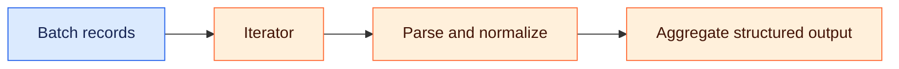

# Iterative-Array-Data-Transformer

[🌐 Naveen Sharma](https://naveensharma.net) · [💼 LinkedIn](https://www.linkedin.com/in/naveensharmatech/)

### 🗺️ Visual overview

Planned design only. This repository currently contains a concept description, without an executable workflow or verified run.

---

A conceptual multi-variable data transformation blueprint map designed to process batch records.  Target Scope: Building baseline logic for custom text parsers, regex tokens to isolate tracking domains, and basic Iterator/Aggregator arrays to manage structural data payloads.

## 🎯 Learning focus

- Batch processing with iterator and aggregator patterns
- Text parsing and regular expressions
- Consistent structured payloads

## 🧪 Before demonstrating a working version

- Add an exported workflow and setup instructions.
- Record a sample input and expected output.
- Test malformed data and failure paths.
- Attach a run screenshot or execution log once validated.

## 🔗 Explore more

[Automation & Agent Lab](https://github.com/naveensharmatech/ai-automation-agent-lab) · [Website projects](https://naveensharma.net/#projects)
